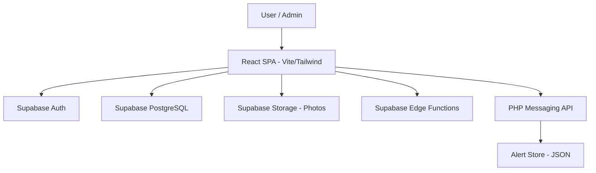

# Attendance Hub

Attendance Hub is a comprehensive, role-based attendance management system designed for educational institutions. Built with a modern tech stack including **React**, **Vite**, **Tailwind CSS**, and **Supabase**, it provides a seamless experience for both administrators and students to track, manage, and report attendance data.

## Features

### Admin Features
- **Student Management**: Add, edit, and view detailed student profiles, including parent contact information and photos.
- **Attendance Marking**: Effortlessly mark daily attendance for all students with a single click for "all present" or individual status updates.
- **History & Logs**: Access complete attendance history with advanced filtering by date, class, and status.
- **Reports & Analytics**: Generate and export attendance statistics, including attendance percentages and trends across the institution.
- **Parent Alerts**: Send automated attendance alerts to parents via a lightweight PHP-based messaging system.

### Student Features
- **Personal Dashboard**: View real-time attendance stats, including total days tracked, absent days, and current attendance percentage.
- **Attendance Calendar**: A color-coded calendar view providing an at-a-glance look at attendance status over the month.
- **Detailed History**: Review every attendance entry marked by the administrator.
- **Performance Reports**: Access and export monthly attendance breakdowns to monitor personal progress.

## Architecture

The application follows a modern decoupled architecture:

- **Frontend**: A responsive React single-page application (SPA) powered by Vite and styled with Tailwind CSS.
- **Backend-as-a-Service (BaaS)**: Supabase handles authentication, real-time database (PostgreSQL), and file storage for student photos.
- **Edge Functions**: Supabase Edge Functions manage administrative tasks like student creation, deletion, and password resets.
- **Messaging API**: A lightweight PHP API handles parent alerts and messaging history, allowing for flexible integration with email or SMS providers.



## Tech Stack

| Layer | Technology |
|---|---|
| **Frontend Framework** | [React 18](https://reactjs.org/) |
| **Build Tool** | [Vite 5](https://vitejs.dev/) |
| **Styling** | [Tailwind CSS 3](https://tailwindcss.com/) |
| **Database & Auth** | [Supabase](https://supabase.com/) |
| **Form Handling** | [React Hook Form](https://react-hook-form.com/) & [Yup](https://github.com/jquense/yup) |
| **Icons** | [Lucide React](https://lucide.dev/) |
| **Date Management** | [date-fns](https://date-fns.org/) |

## Getting Started

### Prerequisites
- Node.js (v18 or higher)
- npm or pnpm
- A Supabase project
- PHP 8.0+ (for parent alerts)

### Installation

1. **Clone the repository**:
   ```bash
   git clone https://github.com/vincenzo-afk/ATTENDENCE-HUB.git
   cd ATTENDENCE-HUB
   ```

2. **Install dependencies**:
   ```bash
   npm install
   # or
   pnpm install
   ```

3. **Environment Configuration**:
   Create a `.env` file in the root directory based on `.env.example`:
   ```env
   VITE_SUPABASE_URL=your_supabase_url
   VITE_SUPABASE_ANON_KEY=your_supabase_anon_key
   VITE_ADMIN_EMAIL=admin@example.com
   VITE_SITE_URL=http://localhost:5173
   VITE_PHP_PARENT_ALERT_URL=http://localhost:8000/send-parent-alert.php
   VITE_PHP_PARENT_ALERTS_HISTORY_URL=http://localhost:8000/get-parent-alerts.php
   ```

4. **Database Setup**:
   Run the SQL script located in `supabase/schema.sql` in your Supabase SQL Editor to set up the necessary tables, views, and RLS policies.

5. **Deploy Edge Functions**:
   ```bash
   npm run supabase:deploy:functions
   ```

### Running the Application

- **Start the frontend**:
  ```bash
  npm run dev
  ```

- **Start the PHP API**:
  ```bash
  npm run php:serve
  ```

## Setup Scripts
- `npm run admin:bootstrap`
  - Verifies Google OAuth bootstrap and prints an OAuth login URL.
  - Sign in using the Gmail set in `VITE_ADMIN_EMAIL`.
- `npm run doctor`
  - Verifies env values, tables/views/RPCs, Google OAuth URL generation, and edge function status.
- `npm run php:serve`
  - Runs the PHP API at `http://localhost:8000` for parent alerts.

## Supabase Configuration
- **Auth**: Enable the **Google** provider in Supabase Auth and add your app URL as the site URL.
- **Storage**: Create a bucket named `student-photos` (or the name set in `VITE_STUDENT_PHOTO_BUCKET`).
- **Secrets**: Set `SUPABASE_URL`, `SUPABASE_ANON_KEY`, `SUPABASE_SERVICE_ROLE_KEY`, and `ADMIN_EMAIL` in your Supabase project settings.

## Access Model
- **Admin**: Login is restricted to the email configured in `VITE_ADMIN_EMAIL`.
- **Student**: Access is granted only if the admin has pre-created a student profile with a matching Gmail address.

## Contributing

We welcome contributions! Please see our [CONTRIBUTING.md](CONTRIBUTING.md) for details on our code of conduct and the process for submitting pull requests.

## License

This project is licensed under the MIT License - see the [LICENSE](LICENSE) file for details.

---

Built with ❤️ by [vincenzo-afk](https://github.com/vincenzo-afk)
